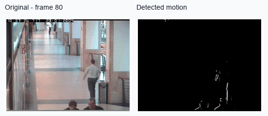
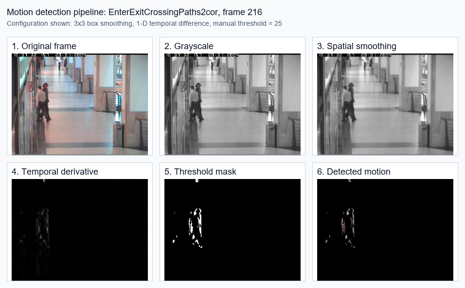

# Image Processing Based Motion Detection

A modular OpenCV and Jupyter motion-detection simulator that converts an image
sequence into grayscale frames, smoothed frames, temporal derivative responses,
binary motion masks, and final foreground overlays.



## What I Built

- Loaded ordered image sequences and kept original BGR frames aligned with
  grayscale processing frames.
- Implemented configurable spatial smoothing: no smoothing, 3x3 box filter,
  5x5 box filter, and 2D Gaussian smoothing with user-selected sigma.
- Implemented multiple temporal derivative operators: consecutive-frame
  difference, centered 0.5[-1, 0, 1] difference, and 1D derivative of Gaussian.
- Converted motion responses into binary masks with manual and adaptive
  thresholding.
- Built an interactive Jupyter dashboard with `ipywidgets` controls for dataset,
  smoothing, temporal derivative, and threshold settings.
- Exported every stage of each run into reproducible folders for inspection and
  comparison.

## Pipeline Preview

The image below shows one saved run on the `EnterExitCrossingPaths2cor` sequence
at a challenging frame where two people cross paths.



Showcased simulator run:

- Sequence: `EnterExitCrossingPaths2cor`
- Frames processed: 485 original frames
- Aligned outputs: 484 derivative, threshold, and detected-motion frames
- Configuration: 3x3 box smoothing, 1-D temporal difference, manual threshold 25

## Experimental Takeaways

The report compares smoothing and temporal derivative combinations across
multiple real-world image sequences. The strongest qualitative result came from
using heavier spatial Gaussian smoothing with lighter temporal smoothing:
spatial Gaussian `sigma=2.0` with temporal DoG `sigma=0.5`. This reduced
background noise while preserving enough object structure for clean motion
masks.

The main trade-off was clear: too little filtering produced jittery masks, while
heavy smoothing in both space and time removed useful motion detail. Adaptive
thresholding detected outlines well, but introduced more noise and lost some
filled object regions compared with tuned manual thresholds.

Read the full write-up here: [CV_Project1_Report.pdf](CV_Project1_Report.pdf).

## Repository Map

```text
.
|-- Dashboard.ipynb              # Interactive simulator and run workflow
|-- CV_Project1_Report.pdf       # Project report, experiments, and conclusions
|-- src/
|   |-- VideoReader.py           # Image sequence loading and frame metadata
|   |-- SpatialSmoothing.py      # Box and Gaussian spatial filters
|   |-- TemporalDerivative.py    # Temporal derivative strategies
|   |-- Threshold.py             # Manual and adaptive thresholding
|   |-- PostProcess.py           # Output alignment and export helpers
|   |-- Utilities.py             # Visualization and dashboard helpers
|   `-- gui.py                   # ipywidgets control panel
|-- assets/                      # README visuals generated from simulator output
`-- requirements.txt             # Python dependencies
```

## Run Locally

```bash
python -m venv .venv
.\.venv\Scripts\activate
python -m pip install -r requirements.txt
jupyter notebook Dashboard.ipynb
```

Put image-sequence folders under `Database/`, or update the dashboard's database
path to point at your own sequences. The simulator writes run artifacts to
`Kabhilesh-Aidan-Project-Output/` with subfolders for original, grayscale,
smoothing, derivative, threshold, and detected-motion frames.

## Authors

Kabhilesh Giri and Aidan Syrgak Uulu, M.S. Electrical and Computer Engineering,
Northeastern University.
